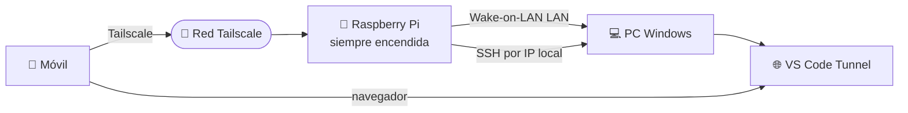

# 🖥️ Desarrollo Remoto desde el Móvil con Raspberry Pi, Tailscale y VS Code Tunnel

Acceder a tu entorno de desarrollo desde **cualquier lugar** usando solo un
**móvil**, una **Raspberry Pi** y un **PC con Windows**. Sin abrir puertos en el
router y con una infraestructura sencilla y de bajo coste.

La solución se apoya en tres componentes:

- **Tailscale** → conectividad segura desde Internet (VPN tipo malla).
- **VS Code Tunnel** → acceso al entorno de desarrollo desde el navegador.
- **Raspberry Pi** → punto de control siempre encendido para automatizar tareas
  (encender el PC, lanzar el túnel, etc.).

---

## 🗺️ Arquitectura

```text
Móvil
  │
  ▼
Red Tailscale  ──────────────► Raspberry Pi ──(LAN / Wake-on-LAN / SSH)──► PC Windows
  │                                                                            │
  └──────────────────────────────────────────────────────────────────►  VS Code Tunnel
```



> ⚠️ **Clave del montaje:** la Raspberry Pi y el PC están en la **misma red local
> (LAN)**. Eso permite que la Pi encienda el PC con Wake-on-LAN (ver Parte 3) y
> le hable por SSH usando su **IP local**, sin necesidad de instalar Tailscale en
> el PC. Solo necesitan Tailscale los dispositivos que entran desde fuera de casa:
> el **móvil** y la **Raspberry Pi**. Desde fuera entras por Tailscale a la Pi, y
> la Pi actúa dentro de tu red.

---

## 🔐 Parte 1 — Acceso seguro con Tailscale

### Instalar Tailscale en la Raspberry Pi

Actualizar el sistema:

```bash
sudo apt update
sudo apt upgrade -y
```

Instalar Tailscale:

```bash
curl -fsSL https://tailscale.com/install.sh | sh
```

Iniciar el servicio:

```bash
sudo systemctl enable --now tailscaled
```

Autenticarse:

```bash
sudo tailscale up
```

Se mostrará una URL similar a `https://login.tailscale.com/a/XXXXXXXX`.
Ábrela desde el móvil o el ordenador y autoriza el dispositivo.

### Instalar Tailscale en el móvil

Este paso es **imprescindible**: el móvil es el dispositivo desde el que te
conectas a la Raspberry Pi cuando estás fuera de casa, así que necesita estar en
la misma red Tailscale.

1. Instala la app **Tailscale** desde la
   [Play Store](https://play.google.com/store/apps/details?id=com.tailscale.ipn)
   (Android) o la [App Store](https://apps.apple.com/app/tailscale/id1470499037) (iOS).
2. Inicia sesión con la **misma cuenta** usada en la Raspberry Pi.
3. Activa la VPN cuando la app lo solicite.

> 💡 **El PC con Windows NO necesita Tailscale.** La Raspberry Pi le habla por la
> red local (Wake-on-LAN y SSH a su IP local), y el acceso al editor desde el
> móvil va por **VS Code Tunnel** (relay de Microsoft), que tampoco depende de
> Tailscale. Instalarlo en el PC sería un paso innecesario.

### Verificación

En la Raspberry, comprobar estado y obtener su IP de Tailscale:

```bash
tailscale status
tailscale ip -4
```

En `tailscale status` deben aparecer al menos la **Raspberry Pi** y el **móvil**
con la misma cuenta. Anota también la **IP local (LAN)** del PC, que usarás para
el SSH desde la Pi:

```powershell
ipconfig | findstr /i "IPv4"
```

---

## 💻 Parte 2 — Desarrollo remoto con VS Code Tunnel

### Instalar Visual Studio Code

Instala VS Code en el PC Windows y comprueba que el comando `code` está
disponible:

```powershell
code --version
```

Si no funciona:

1. Abre VS Code.
2. Pulsa `Ctrl + Shift + P`.
3. Ejecuta: `Shell Command: Install 'code' command in PATH`.

O reinstala VS Code marcando la opción **Add to PATH**.

### Crear el túnel

```powershell
code tunnel --accept-server-license-terms
```

Sigue el proceso de autenticación mediante GitHub o Microsoft. Comprueba el
estado:

```powershell
code tunnel status
```

> ⚠️ **`--accept-server-license-terms`** evita que el túnel se quede esperando
> confirmación, algo importante cuando lo lances de forma remota por SSH (Parte 3).

Para que el túnel **sobreviva a reinicios** y arranque solo, puedes instalarlo
como servicio:

```powershell
code tunnel service install
```

### Acceso desde el móvil

1. Abre el navegador.
2. Entra en [vscode.dev](https://vscode.dev) (o la URL `https://vscode.dev/tunnel/...`).
3. Inicia sesión con la **misma cuenta** usada para crear el túnel.
4. Selecciona el equipo.
5. Abre cualquier proyecto y trabaja con normalidad.

---

## 🍓 Parte 3 — Raspberry Pi como centro de control

### Instalar Wake-on-LAN

```bash
sudo apt install wakeonlan -y
```

### Configurar Wake-on-LAN en Windows

**BIOS/UEFI** — activar (los nombres varían según la placa):

- Wake On LAN
- Power On By PCI-E / Wake on PCIe

Guarda los cambios y reinicia.

**Adaptador de red** — en *Administrador de dispositivos → Adaptador de red →
Propiedades*, activa:

- Wake on Magic Packet
- Permitir que este dispositivo reactive el equipo

Obtener la MAC del PC:

```powershell
ipconfig /all
```

Ejemplo: `AA-BB-CC-DD-EE-FF`.

Probar Wake-on-LAN **desde la Raspberry**:

```bash
wakeonlan AA:BB:CC:DD:EE:FF
```

> ⚠️ **Wake-on-LAN NO viaja por Tailscale.** El "magic packet" es un *broadcast*
> de red local (UDP a `255.255.255.255`), y las VPN como Tailscale no enrutan
> broadcasts. Por eso `wakeonlan` se ejecuta **en la Raspberry**, que está en la
> misma LAN que el PC. Desde fuera de casa: entras por Tailscale a la Pi, y la Pi
> manda el magic packet dentro de tu red.

### Configurar SSH Raspberry → Windows

Instalar OpenSSH Server en Windows (PowerShell como Administrador):

```powershell
Get-WindowsCapability -Online | Where-Object Name -like 'OpenSSH.Server*'
```

Si aparece como `NotPresent`:

```powershell
Add-WindowsCapability -Online -Name OpenSSH.Server~~~~0.0.1.0
```

Iniciar y dejar el servicio en automático:

```powershell
Start-Service sshd
Set-Service -Name sshd -StartupType Automatic
Get-Service sshd   # debe aparecer Status: Running
```

### Probar conectividad SSH

Desde la Raspberry:

```bash
ssh usuario_windows@IP_LOCAL_PC
```

La primera vez responde `yes` a la pregunta de la huella y escribe la contraseña
de Windows. Si entras, SSH funciona. Sal con `exit`.

### Generar la clave SSH en la Raspberry

Comprueba si ya existe (`ls ~/.ssh`). Si no hay `id_ed25519`, créala:

```bash
ssh-keygen -t ed25519
```

Acepta las opciones por defecto y muestra la clave pública:

```bash
cat ~/.ssh/id_ed25519.pub
```

Copia la línea completa (`ssh-ed25519 AAAA... usuario@raspberry`).

### Autorizar la clave en Windows ⚠️ (el paso que más falla)

> ⚠️ **Importante:** en Windows, si tu usuario pertenece al grupo
> **Administradores** (lo normal en un PC de casa), OpenSSH **ignora**
> `C:\Users\<usuario>\.ssh\authorized_keys` y usa en su lugar el archivo común
> `C:\ProgramData\ssh\administrators_authorized_keys`. Si pones la clave solo en
> tu carpeta de usuario, SSH **seguirá pidiéndote la contraseña** y pensarás que
> la clave no funciona.

**Opción A (recomendada) — usuario administrador.** En PowerShell como
Administrador, pega la clave pública de la Raspberry y ajusta permisos:

```powershell
$clave = "ssh-ed25519 AAAA... usuario@raspberry"
Add-Content -Path "C:\ProgramData\ssh\administrators_authorized_keys" -Value $clave
icacls "C:\ProgramData\ssh\administrators_authorized_keys" /inheritance:r
icacls "C:\ProgramData\ssh\administrators_authorized_keys" /grant "Administrators:F" "SYSTEM:F"
Restart-Service sshd
```

**Opción B — usuario NO administrador.** Vale el `authorized_keys` por usuario:

```powershell
cd $HOME
New-Item -ItemType Directory -Force -Path .ssh | Out-Null
notepad .ssh\authorized_keys   # pega aquí la clave y guarda
icacls "$HOME\.ssh" /inheritance:r
icacls "$HOME\.ssh" /grant "$($env:USERNAME):(OI)(CI)F"
icacls "$HOME\.ssh\authorized_keys" /inheritance:r
icacls "$HOME\.ssh\authorized_keys" /grant "$($env:USERNAME):F"
Restart-Service sshd
```

### Validar la autenticación por clave

Desde la Raspberry:

```bash
ssh usuario_windows@IP_LOCAL_PC hostname
```

Si devuelve el nombre del PC **sin pedir contraseña**, está correcto. Para ver
qué método usa:

```bash
ssh -v usuario_windows@IP_LOCAL_PC
# Deberías ver: Offering public key / Server accepts key / Authenticated using publickey
```

### Crear aliases en la Raspberry

Edita `~/.bashrc` (`nano ~/.bashrc`) y añade:

```bash
alias pc-on='wakeonlan AA:BB:CC:DD:EE:FF'
alias pc='ssh usuario_windows@IP_LOCAL_PC'
alias pc-tunnel='ssh usuario_windows@IP_LOCAL_PC "cmd /c start \"\" code tunnel --accept-server-license-terms"'
alias pc-kill-tunnel='ssh usuario_windows@IP_LOCAL_PC "code tunnel kill"'
alias pc-status='ssh usuario_windows@IP_LOCAL_PC "tasklist | findstr -i code"'
```

Aplica los cambios:

```bash
source ~/.bashrc
```

> ⚠️ **Para parar el túnel usa `code tunnel kill`** (comando oficial), no
> `taskkill /F /IM code-tunnel.exe`: el binario real suele llamarse `code.exe` y
> ese `taskkill` puede no encontrarlo o cerrar procesos que no toca.

---

## 📱 Conectarte por SSH desde el móvil (Android)

Para abrir la sesión SSH contra la Raspberry desde el móvil necesitas un cliente
SSH. Una opción recomendada en Android es la app
**[Lobishell - SSH Client](https://play.google.com/store/apps/details?id=de.lobianco.saftssh)**
(cliente SSH sencillo y cómodo para gestionar conexiones guardadas):

1. Instala **Lobishell** desde la Play Store.
2. Crea una conexión nueva apuntando a la **IP de Tailscale de la Raspberry**,
   con tu usuario de la Pi.
3. Guarda la conexión para reutilizarla con un toque.
4. Desde esa sesión ya puedes usar los aliases (`pc-on`, `pc-tunnel`, etc.).

> 💡 Alternativas conocidas: Termius o JuiceSSH. Cualquier cliente SSH sirve;
> lo importante es que el móvil esté conectado a Tailscale.

---

## 🚀 Flujo completo desde fuera de casa

1. Conéctate a **Tailscale** desde el móvil.
2. Abre una sesión **SSH** contra la Raspberry Pi (p. ej. con **Lobishell**).
3. Enciende el PC: `pc-on`
4. Espera a que arranque el equipo.
5. Inicia el túnel: `pc-tunnel`
6. Abre **vscode.dev** en el navegador.
7. Selecciona el equipo y abre el proyecto.
8. Trabaja normalmente desde el navegador.

Comandos de uso diario:

| Acción | Comando |
| --- | --- |
| Encender el PC | `pc-on` |
| Conectarse al PC | `pc` |
| Iniciar el túnel | `pc-tunnel` |
| Ver estado | `pc-status` |
| Detener el túnel | `pc-kill-tunnel` |

---

## ✅ Checklist de validación

- [ ] Tailscale instalado en la Raspberry Pi
- [ ] Tailscale instalado en el móvil
- [ ] Raspberry visible en Tailscale
- [ ] Móvil visible en Tailscale
- [ ] IP local (LAN) del PC anotada
- [ ] OpenSSH Server instalado en Windows
- [ ] Autenticación SSH por clave funcionando (clave en el archivo correcto ⚠️)
- [ ] `ssh usuario_windows@IP_LOCAL_PC hostname` funciona sin contraseña
- [ ] Wake-on-LAN operativo desde la Raspberry
- [ ] VS Code Tunnel operativo
- [ ] Aliases configurados
- [ ] Cliente SSH del móvil configurado (p. ej. Lobishell)
- [ ] Acceso validado desde datos móviles
- [ ] Apertura de proyectos desde VS Code Web validada

---

## 🎯 Resultado final

Con una **Raspberry Pi 3**, **Tailscale**, **SSH**, **Wake-on-LAN** y
**VS Code Tunnel** consigues:

- Acceder a tu entorno de desarrollo desde cualquier lugar.
- Trabajar desde móvil, tablet o portátil.
- Encender remotamente el ordenador.
- Gestionar el túnel desde la Raspberry Pi.
- **Evitar abrir puertos en el router.**
- Mantener una infraestructura sencilla y de bajo coste.
- Usar VS Code desde el navegador igual que en local.

Esta es una base sencilla sobre la que después se pueden añadir automatizaciones,
APIs o paneles web para administrar toda la infraestructura desde una única
interfaz.

---

📄 Licencia [MIT](LICENSE).
